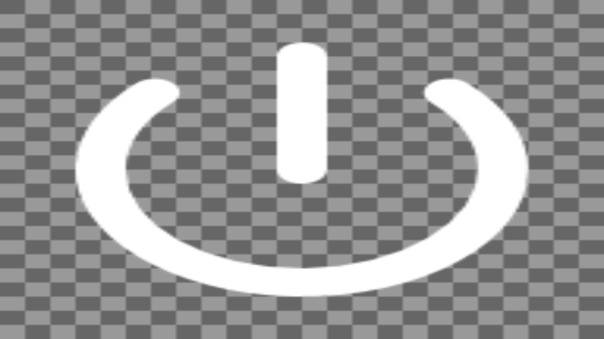
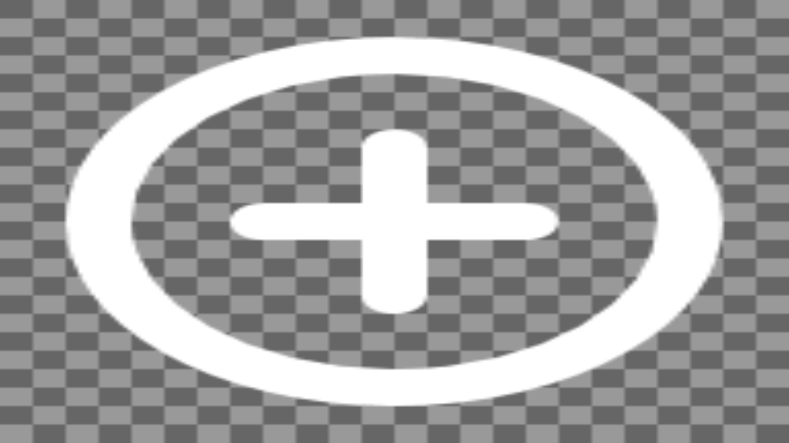
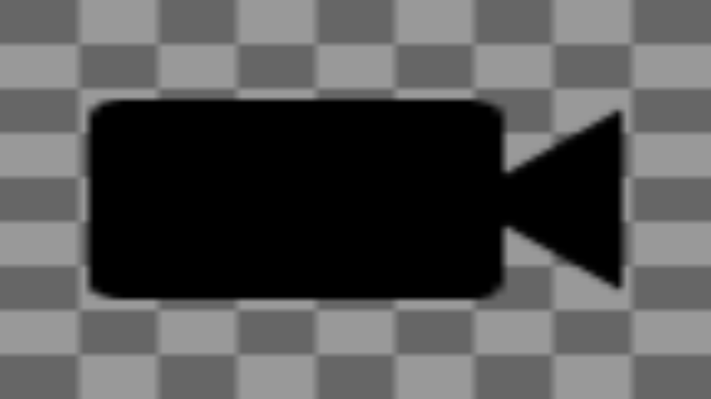

# icons

## Overview

One of the ways you would likely want to customize your image are adding assets
like icons, which could be shared by multiple applications that are integrated
into the project.

All content that is placed into the **icons** sub-folder
(eg: <repo>/assets/icons/icons) will be placed into the image at the location:
**/system/share/icons**. Directory structure will be maintined. This location
is then linked from one other location for compatibility reasons:
- /usr/share/icons

Several fixed icons have been checked into the **icons** sub-folder.
In addition, the Google Material Design Icon pack, version 4.0.0, is downloaded
and made available at **material-design-icons-4.0.0** for processing. The build
will process some of the Material icons into a form suitable for the target
and put the resulting files into the **icons** sub-folder.

## Notes about icon usage
- 128x128 icons are generated for demolauncher
- 40x40 icons are the ideal size for the screenwm window manager dock
- demolauncher's icons are generally white by default, but could be switched
  to black or colored icons, depending on what background is selected
- screenwm icons are generally black because the dock backround is lightly
  colored, but color icons work as well.
- with respect to icon and background image formats, RGBA 32bit png icons work
  best for both demolauncher and screenwm

## Google Material Icons
The Google Icons site, where you can go review the latest icons is:
[https://fonts.google.com/icons?icon.size=24&icon.color=%231f1f1f](https://fonts.google.com/icons?icon.size=24&icon.color=%231f1f1f)

This is where you can search and browse for icons and find their base name to
locate the individual icon files to integrate. Once you have the base name,
you can search for the icons in the downloaded set of icons that is obtained
from the GitHub repo located at:
[https://github.com/google/material-design-icons](https://github.com/google/material-design-icons)

Note that Google's current set of icons that you can browse is called Material
Symbols, which is now generated using variable fonts. As a result, some of the
icons that show up in the search are not available in Google Material Icons,
which was last updated in 2020 (the version 4.0.0 release package is what we
are downloading in the Makefile).

The following icons were integrated for the default demolauncher screen:
- round_power_settings_new
- round_add_circle

The following icons were integrated for an alternative window manager,
screenwm, that is available to use, which will be described in more detail in
the [system](../system) README:
- baseline_settings
- baseline_crop_square
- sharp_subdirectory_arrow_left
- baseline_videocam

## Adding additional Google Material Icons

Additional icons from the Material design can be processed and added to the
**icons** folder. A GNU make macro called **CONVERT_ICON** has been provided
to manage this. The macro will do one or more conversions and place the
resulting file(s) into **icons**.

To make use of the macro add a line like the following to the makefile
```
$(eval $(call CONVERT_ICON,<in_file>,<dim>,<out_file>,<transforms>))
```
Where
`<in_file>` == Is the relative path from **material-design-icons-4.0.0** to the
               file to process.
`<dim>` == The desired dimentions, in pixels, of the output icon. This is used
           for both the width and the height, so all output icons MUST currently
           be square.
`<out_file>` == The basename of the output file, without extension. A suffix,
                indicating the transform, and an extension (.png) will
                automatically be added by the macro.
`<transforms>` == A space separated list of transforms to apply. Each transform
                  will generate a file with the results of that transform.
                  See below for the supported transforms.

### Transforms
One or more transforms can be supplied to the CONVERT_ICON macro. The supported
transforms are detailed below.

**NOTE** Transforms are NOT combined together. Each transform is applied
         individually and generates an output file for that transform. In other
         words if you specify a transform of `black white` you will get two
         output files, one for the `black` transform and one for the `white`
         transform.

#### black
This transform scales the input to the specified dimension while making no
changes to the pixel data.

The resulting image will be placed into a file with the name
`<out_file>_black.png`.

> The name of this transform is a bit of a misnomer and comes from specifying
> what type of background the image should have. Since by default material
> design icons have a black background this transform just does the scaling.

#### white
This transform scales the input to the specified dimension while changing
all black pixels (#000000) to white (#ffffff). Since material design icons have
a black background by default this essentially changes the background of the
output icon to white.

The resulting image will be placed into a file with the name
`<out_file>_white.png`.

#### black_translucent
This transform scales the input to the specified dimension while adding an
alpha channel with 25% opacity. No other colour changes are made to the pixels.

The resulting image will be placed into a file with the name
`<out_file>_black_translucent.png`.

#### white_translucent
This transform scales the input to the specified dimension, changes all black
pixels (#000000) to white (#ffffff), and adds an alpha channel with 25% opacity.
Since material design icons have a black background by default this essentially
changes the background of the output icon to white.

The resulting image will be placed into a file with the name
`<out_file>_white_translucent.png`.

## General Integration Approach

If non Material design icons are desired you can integrate them into the build.
One suggested method of doing this is detailed in the following steps.

### Add Makefile target to download icons

Add a target to clone an icons repo, or in some cases, download a release
package generated from the repo. It is strongly recommended to pick a package
that can be downloaded again in a reproducible manner. That usually means a
specific version of SHA.

### Unpack the icons

Unpack the icons package into a folder, if required. Note that it is best to
use the folder name of the unpacked package, or the repo folder, as the target
name, such that the download will not repeat if a previous build completed the
download. This is more efficient, but it also means you need to perform a
clean operation with make to forcibly update the contents, if it comes from a
git repo.

### Add targets for each icon

A Makefile target should be added for each icon to be integrated, especially
if the icons have to be manipulated, like they need to be colorized. The icons
download target should also be added as a dependency to ensure the icons
package or repo folder is created before the target is executed

After downloading and colorizing the icons, they should be copied to the
**icons** folder.

### Add new target as a dependency to the all target

Add the new make target for the icons being integrated as a dependency to the
all target, so that it will build by default.

## Utilities

### showimage

A utility application called showimage was integrated after the SDL_image
library was integrated. This application allows you to display an image or icon.

This utility is useful to check that integrated icons or images are correctly
integrated and are not corrupt. See some example command below, and associated
screenshots, that you can run to confirm some of the integrated icons are not
corrupt in your generated image.

Note that this utility generally displays full screen, so smaller graphical
icons will likely display distorted as a result.

Transparent icons will render with a checker box pattern behind them.

Usage:

```bash
qnxuser@qnxpi:~$ showimage      
INFO: Usage: showimage [-fullscreen] [-save file.png] <image_file> ...
```

## Checking integrated icons

## rounded power button icon (white)

This icon is visible on first boot, as part of the default demolauncher
interface:


but you can also display it with showimage as follows:

```bash
showimage /usr/share/icons/google/round_power_button_white.png
```



## add circle icon (white)

This icon is also visible on first boot as part of the default demolauncher
interface, but you can also display it with showimage as follows:

```bash
showimage /usr/share/icons/google/round_add_circle_button_white.png
```



## video camera icon (black)

This icon is visible as part of alternative window manager user interface,
but you can also display it with showimage as follows:

```bash
showimage /usr/share/icons/google/video_icon_black.png
```



Note that there is also a larger white version of this icon for use with the
demolauncer as well.

## Next Steps

What can you do next?

- You can integrate additional Google Material icons that you like for the
  desktop or other applications.
- In the fonts folder, we integrated free Font Awesome fonts, but that package
  also contains the SVG files for all of the icons in the fonts.
  If you are a Font Awesome fan, integrate some Font Awesome icons, and
  potentially swap out the Google Material icons that are similar if that
  works better for you.
