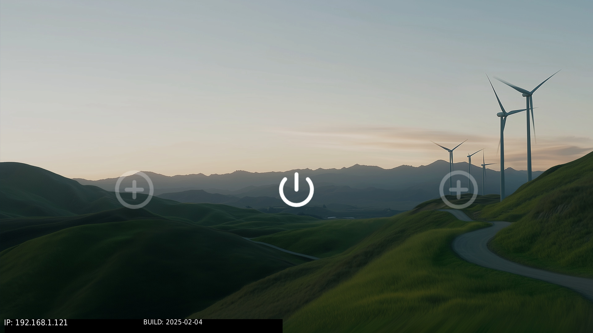
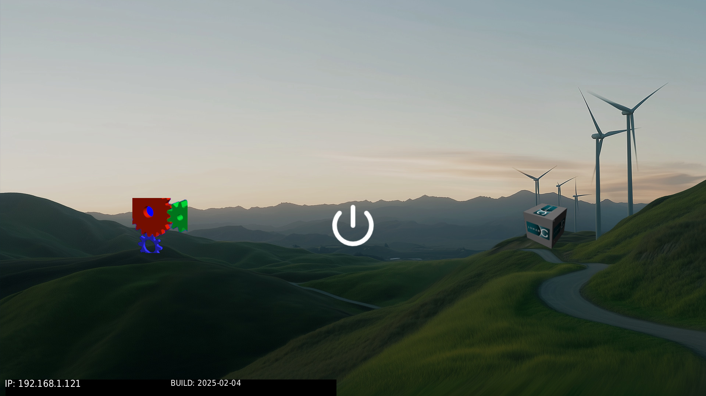
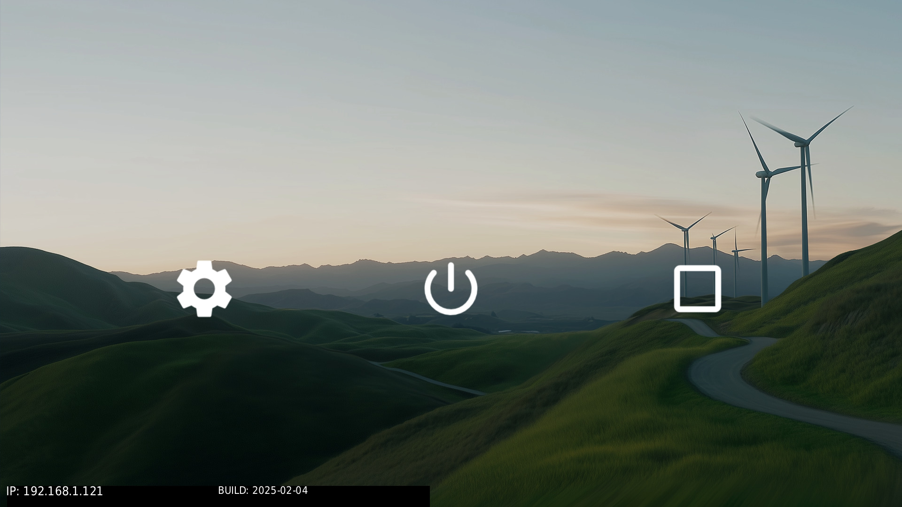
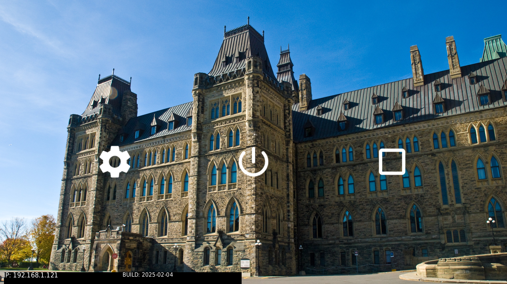
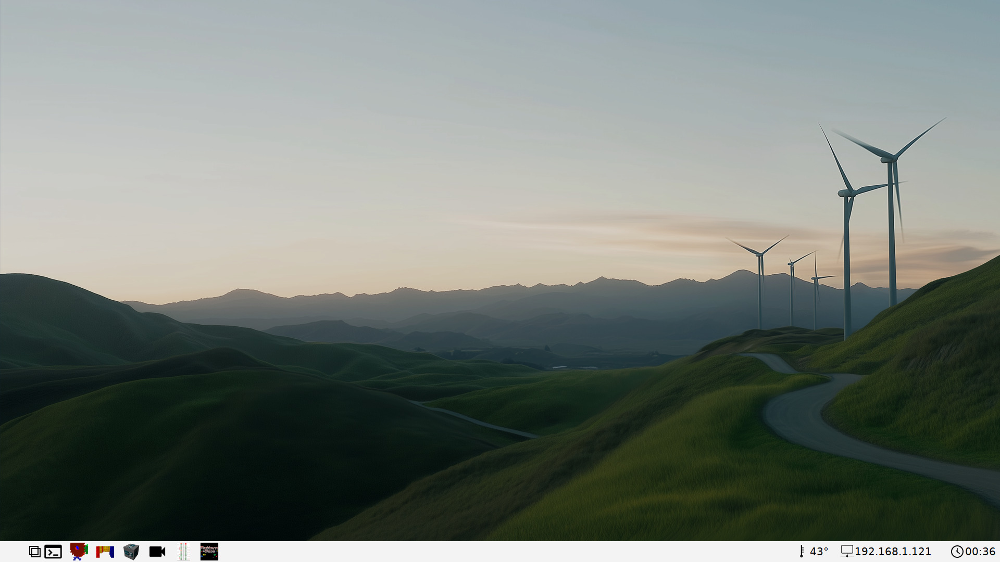
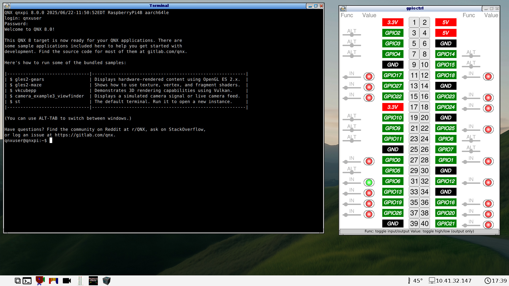

# snippets

## Overview

The snippets folder contains portions of build files that are used by
mkqnximage to create partitions for the SD card image generated by the project
build.  mkqnximage combines these files with boilerplate snippets to assemble
full build files (.build), that are required to generate partition files
(.part) files for the image generation process.

## Combination Rules

The initial combination is done by combining the common snippet files with the
target snippet files. If a target snippet file has the same name as a common
one, then the target specific one wins and is used; the common one is ignored
in this case.

After this initial combination, mkqnximage has specific rules governing how
individual snippets are used.  Each name of each snippet file has a prefix that
determines which build file, script or other file it is included in, a suffix
to make the file name unique, and optionally a string of the form 'NN' or '~NN'
that can be used to influence ordering with respect to other files using the
same prefix.  So for example:

    <prefix>.<suffix>    - Inserted in default postion
    <prefix>.80.<suffix> - Inserted before everything but lower number files
    <prefix>.~80.<suffix>- Inserted after everything except lowered numbered
                           files that include ~

### Snippet prefixes
The prefixes supported by mkqnximage are detailed in this section.

#### ifs_files
Allows for additional files to be included in the ifs partition.

#### system_files
Allows for additional files to be included in the system partition.

#### data_files
Allows for additional files to be included in the data partition.

#### ifs_env
Used mainly for creating procmgr symlinks and setting environment variables at
the beginning of the IFS start-up script.

#### ifs_start
Commands used for starting the system. This includes security policy loading
if appropriate. It is inserted at the end of the IFS start-up script, just
before execution of startup.sh or slm.

#### post_start
Included in post_startup.sh a shell script run at the end of startup.sh
and by the slm configuration file.

#### slm
Included in the slm configuration file.

#### profile
Included in /system/etc/profile.

#### passwd_file
Include content in the passwd file.

#### shadow_file
Include content in the shadow file.

#### group_file
Include content in the group file.

#### uids
Add uid definitions.

#### boot
Used to generate the boot entry in the IFS build file.

#### definitions
Add content to `_definitions.inc`, the file or C preprocessor definitions
used to modify the contents of other files.

#### options
Used to add procnto command line options and expand the size of disk partitions
and free inodes.

#### generate
Used to generate files out of snippet files.

#### secpolgen
Used to configure commands used when starting secpolgenerate.

#### secpolused
Contains secpol rules that should be treated as having been used and thus will
be added to generated policies.

## Snippets

Each target has two sets of snippets. One set is common to all targets, the
other is target specific.

Each set is created by taking the standard snippets for the set and
adding/overriding any variant specific snippets. So for example, if there was
a variant called 'big' then the set of snippets for this variant is made by
taking the snippets in the `common` sub-directory then copying any snippets
in `common/big` on top.

See the README.md files in each subdirectory for more information about the
snippet files in those subdirectories.

## Customizations

Several customizations are possible with this project.

Below we will review the differences in how existing customizations would be
performed, and we will also cover some new customizations. Where customizations
are made differs with this project than on the device.
Look for notes below pointing out the differences.

Once customizations are made, you will need to rebuild the image and flash to
an SD card to then try the changes on a device.

### Configuring cURL

This project includes changes that pre-configure the installed version of cURL
with root certificates downloaded during the build. Any instructions in the

Quickstart wiki related to configuring cURL are no longer required.
A new script called updatecacert has been added to download updated
certificates in the future on a live device. The build itself will download a
fresh set of certificates if a clean operation is performed before a new build.

### Keyboard layout

The instructions for changing the keyboard layout can be found in the
[Next Steps -> Keyboard layout](https://gitlab.com/qnx/quick-start-images/raspberry-pi-qnx-8.0-quick-start-image/-/wikis/Next-steps#keyboard-layout)
section of the wiki for the Quickstart Image.

To make the equivalent change for this project, to incorporate into the build
itself, the change described above has to be made to
[../system/usr/lib/graphics/rpi4-drm/graphics-rpi4.conf](../system/usr/lib/graphics/rpi4-drm/graphics-rpi4.conf)
instead.

### Display resolution

The instructions for changing the display resolution can be found in the
[Next Steps -> Display  resolution](https://gitlab.com/qnx/quick-start-images/raspberry-pi-qnx-8.0-quick-start-image/-/wikis/Next-steps#display-resolution)
section of the wiki for the Quickstart Image.

To make the equivalent change for this project, to incorporate into the build
itself, the change described above has to be made to
[../system/usr/lib/graphics/rpi4-drm/graphics-rpi4.conf](../system/usr/lib/graphics/rpi4-drm/graphics-rpi4.conf)
instead.

The instructions that rely on runtime commands do not apply for build changes
so you need to know the display resolution in advance, or make a guess, build
the image, then double check via runtime instructions on the device, and then
you can go back and try the change again and rebuild the image with the correct
settings.

### Camera

If you wish to experiment with camera support, you can adjust the default
configuration for launch by commenting (or uncommenting) the entries in the
target specific [post_start.~30.sensor_framework](post_start.~30.sensor_framework)
snippet, where the sensor service is started.

**NOTE** Not all camera configurations are available for all targets. The examples given below are for the RPi4 target.

For example, look for these lines:

```bash
    # Simulator camera i.e. color bars
    sensor -U 521:521,1001 -r /system/share/sensor -c /system/etc/system/config/sensor_demo.conf
```

and comment out the command as follows:

```bash
    # Simulator camera i.e. color bars
    #sensor -U 521:521,1001 -r /system/share/sensor -c /system/etc/system/config/sensor_demo.conf
```

and then look for these lines:

```bash
    # Camera Module 3
    #sensor -U 521:521,1001 -b external -r /system/share/sensor -c /system/etc/system/config/camera_module3.conf
```

and change to:

```bash
    # Camera Module 3
    sensor -U 521:521,1001 -b external -r /system/share/sensor -c /system/etc/system/config/camera_module3.conf
```

to try out the camera samples with Raspberry PI Camera Module v3, once you
build the image, flash it to an SD card with a device.

Review the other configurations to find the appropriate configuration for any
other supported camera that you may have.

### Adding binaries

Adding new binaries to the image is somewhat easier when you can build the
image yourself.

The most straightforward way to add prebuilt binaries would be to:

1. Add the prebuilt binary to the [system](../system) folder, in the appropriate
folder or create a folder or folders with the same relative path as it would
appear in the system partition on the device.

2. Add an entry, similar to the example below, to
[system_files.custom.common](common/system_files.custom.common) or a new
partial add-on snippet for the system partition:

```bash
bin/gpio-bcm2711=bin/gpio-bcm2711
```

The path to the left of the "=" is the relative path to place the file to
`/system` on the device, and the path to the right is the relative path inside
the [system](../system) folder in this project.

What about binaries that are built from open source projects? They are installed
in the staging area located at [src/stage](../src/stage) so you need to account
for its relative path from that location for the right side expression, and you
still set the left side of the entry to the relative system path on the device.

### Customizing the Welcome screen / Desktop

Existing instructions for adjusting the Welcome screen placeholder desktop icons
can be found in the
[Next Steps -> Customizing the Welcome screen](https://gitlab.com/qnx/quick-start-images/raspberry-pi-qnx-8.0-quick-start-image/-/wikis/Next-steps#customizing-the-welcome-screen)
section of the wiki for the Quickstart Image for more details.

We will review how to do the same customizations in this project,
and more, below.

#### Customizing demolauncher icons

The current desktop files are leveraging Google Material Design icons that were
integrated in the assets/icon folder, that are similar to the icons used in
previous versions of the Quickstart image, but have a slightly flatter look.
The screenshot below shows how the default demolauncher looks like on first
boot, without customizations:



Let's try changing the two placeholder icons, left and right, and point them
to the gles2-gears and vkcubeapp demo applications respectively. You can use
the larger versions of those desktop icons that are included in the project.

Look for this portion of the
[common/system_files.custom.window_managers_demolauncher_config](common/system_files.custom.window_managers_demolauncher_config)
snippet:

```bash
[type=file uid=0 gid=0 perms=0644] etc/desktop_files/right.desktop={
[Desktop Entry]
Name=Placeholder
Exec=true
Icon=/system/share/icons/google/round_add_circle_button_white_translucent.png
Categories=Utilities
}
[type=file uid=0 gid=0 perms=0644] etc/desktop_files/left.desktop={
[Desktop Entry]
Name=Placeholder
Exec=true
Icon=/system/share/icons/google/round_add_circle_button_white_translucent.png
Categories=Utilities
}
```

and change to:

```bash
[type=file uid=0 gid=0 perms=0644] etc/desktop_files/right.desktop={
[Desktop Entry]
Name=Cube
Exec=/system/bin/vkcubepp
Icon=/system/etc/images/vkcube_large.png
Categories=Utilities
}
[type=file uid=0 gid=0 perms=0644] etc/desktop_files/left.desktop={
[Desktop Entry]
Name=Gears
Exec=/system/bin/gles2-gears
Icon=/system/etc/images/gles2-gears_large.png
Categories=Utilities
}
```

After you rebuild, flash the image to the SD card and boot the device.
You will see the placeholder icons replaced with color icons that launch the
GLES2 Gears and Vulkan Cube demo apps included in the image:



Alternatively, you could apply this update instead:

```bash
[type=file uid=0 gid=0 perms=0644] etc/desktop_files/right.desktop={
[Desktop Entry]
Name=Cube
Exec=/system/bin/vkcubepp
Icon=/system/share/icons/google/cube_icon_white_large.png
Categories=Utilities
}
[type=file uid=0 gid=0 perms=0644] etc/desktop_files/left.desktop={
[Desktop Entry]
Name=Gears
Exec=/system/bin/gles2-gears
Icon=/system/share/icons/google/gears_icon_white_large.png
Categories=Utilities
}
```

After you rebuild, flash the image to the SD card and boot the device, you
will see the placeholder icons replaced with additional Google Material Design
icons. The same demo apps launch with the above change, if you prefer the look
of flatter icons from this set:



#### Customizing the demolauncher background image

Aside from modifying the icons, you can also switch the background image used
for the demolauncher to one of your own background images.

The first thing you need to do is add the new background image to the window
manager's snippet.

Look for this portion of the
[common/system_files.custom.window_managers_demolauncher_config](common/system_files.custom.window_managers_demolauncher_config)
snippet:

```bash
[type=file uid=0 gid=0 perms=0444] etc/images/background_1080p.png=images/background_1080p.png
```
and then add a similar entry for your own image added to the folder
[assets/images](../assets/images). In this case, I will add a background image
called DSC_0133_1080p.png, following the line above in the snippet:

```bash
[type=file uid=0 gid=0 perms=0444] etc/images/DSC_0133_1080p.png=images/DSC_0133_1080p.png
```

Note: This step is only adding a 1080p image, which will work with 1080p
displays, but if your display is 720p, add a customized 720p image instead.

The next change required is to update the
[common/post_start.~40.window_manager](common/post_start.~40.window_manager)
snippet to update the demo launcher command to provide the new background
image base name.

Look for this line:

```bash
    demolauncher -a /system/etc/desktop_files &
```

and change it to:

```bash
    demolauncher -a /system/etc/desktop_files -b /system/etc/images/DSC_0133 &
```

After you rebuild, flash the image to the SD card and boot the device, you
will see the default background image replaced with your own:



#### Switching to the screenwm window manager

Perhaps the demolauncher is restricting and you want to try setting up a
desktop environment similar to your development host? Switching to launching
screenwm may be what you are looking for. We will review how to do that next
and further customize it in similar ways demolauncher can be customized.

Let's start by changing the startup sequence.  Look for the following lines in
the [common/post_start.~40.window_manager](common/post_start.~40.window_manager)
snippet:

```bash
    # enable lines below to run the demolauncher and fullscreen
    # window manager
    echo "Using Full Screen Window Manager..."
    fullscreen-winmgr &
    demolauncher -a /system/etc/desktop_files &

    # enable lines below to run the screenwm window manager
    #echo "Using screenwm Window Manager..."
    #screenwm &
```

and change to:

```bash
    # enable lines below to run the demolauncher and fullscreen
    # window manager
    #echo "Using Full Screen Window Manager..."
    #fullscreen-winmgr &
    #demolauncher -a /system/etc/desktop_files &

    # enable lines below to run the screenwm window manager
    echo "Using screenwm Window Manager..."
    screenwm &
```

Essentially commenting out the startup calls to launch demolauncher to launch
screenwm instead.

After you rebuild, flash the image to the SD card and boot the device, you
will see the screenwm desktop with the default background image and default
desktop icons:



Note that screenwm does not open full screen borderless windows, so you can
open multiple apps in separate smaller windows. See the screenshot below
showing the same screen with the terminal and gpioctrl apps running:



#### Customizing the screenwm desktop icons

Customizing the screenwm desktop icons follows a similar approach to how
demolauncher icons are customized. One major difference is that there is no
preset limit to the number of desktop files you can define for dock icons,
although you have a set amount of space to work with on the screen, depending
on the display resolution.

Look for this portion of the
[common/system_files.custom.window_managers_screenwm](common/system_files.custom.window_managers_screenwm)
snippet:

```bash
[type=file uid=0 gid=0 perms=0644] opt/screenwm/terminal.desktop={
[Desktop Entry]
Name=Terminal
Exec=/system/bin/st /system/etc/st_boot.sh
Icon=images/terminal_black.png
Categories=Utilities
}

[type=file uid=0 gid=0 perms=0644] opt/screenwm/gears.desktop={
[Desktop Entry]
Name=Gears
GenericName=gles2-gears
Exec=/system/bin/gles2-gears
Icon=images/gles2-gears.png
Categories=Utilities
}

[type=file uid=0 gid=0 perms=0644] opt/screenwm/maze.desktop={
[Desktop Entry]
Name=Maze
GenericName=gles2-maze
Exec=/system/bin/gles2-maze
Icon=images/gles2-maze.png
Categories=Utilities
}

[type=file uid=0 gid=0 perms=0644] opt/screenwm/camera.desktop={
[Desktop Entry]
Name=Camera_Viewfinder
GenericName=camera_example
Exec=/system/bin/camera_example3_viewfinder
Icon=/system/share/icons/google/video_icon_black.png
Categories=Utilities
}

[type=file uid=0 gid=0 perms=0644] opt/screenwm/gpioctrl.desktop={
[Desktop Entry]
Name=GPIO-Controller
GenericName=gpioctrl
Exec=/system/bin/gpioctrl
Icon=images/gpioctrl.png
Categories=Utilities
}

[type=file uid=0 gid=0 perms=0644] opt/screenwm/patrace.desktop={
[Desktop Entry]
Name=Pattern Race
GenericName=patrace
Exec=/system/bin/patrace
Icon=images/patrace.png
Categories=Games
}
```

The following change swaps out some of the color icons with flatter black
Google Material Design icons:

```bash
[type=file uid=0 gid=0 perms=0644] opt/screenwm/terminal.desktop={
[Desktop Entry]
Name=Terminal
Exec=/system/bin/st /system/etc/st_boot.sh
Icon=images/terminal_black.png
Categories=Utilities
}

[type=file uid=0 gid=0 perms=0644] opt/screenwm/gears.desktop={
[Desktop Entry]
Name=Gears
GenericName=gles2-gears
Exec=/system/bin/gles2-gears
Icon=/system/share/icons/google/gears_icon_black.png
Categories=Utilities
}

[type=file uid=0 gid=0 perms=0644] opt/screenwm/maze.desktop={
[Desktop Entry]
Name=Maze
GenericName=gles2-maze
Exec=/system/bin/gles2-maze
Icon=/system/share/icons/google/maze_icon_black.png
Categories=Utilities
}

[type=file uid=0 gid=0 perms=0644] opt/screenwm/camera.desktop={
[Desktop Entry]
Name=Camera_Viewfinder
GenericName=camera_example
Exec=/system/bin/camera_example3_viewfinder
Icon=/system/share/icons/google/video_icon_black.png
Categories=Utilities
}

[type=file uid=0 gid=0 perms=0644] opt/screenwm/gpioctrl.desktop={
[Desktop Entry]
Name=GPIO-Controller
GenericName=gpioctrl
Exec=/system/bin/gpioctrl
Icon=images/gpioctrl.png
Categories=Utilities
}

[type=file uid=0 gid=0 perms=0644] opt/screenwm/patrace.desktop={
[Desktop Entry]
Name=Pattern Race
GenericName=patrace
Exec=/system/bin/patrace
Icon=images/patrace.png
Categories=Games
}
```

See the screenshot below showing screenwm with the updated desktop icons:


#### Customizing the screenwm background image

Aside from modifying the icons, you can also switch the background image used
by screenwm to one of your own background images.

The first thing you need to do is add the new background image to the window
managers snippet.

Look for this portion of the
[common/system_files.custom.window_managers_screenwm](common/system_files.custom.window_managers_screenwm)
snippet.

```bash
[type=file uid=0 gid=0 perms=0644] opt/screenwm/screenwm.ini={
[General]
background=/system/etc/images/background_1080p.png
taskbar=bottom
screenIdle=20
}
```

which creates the screenwm configuration file, and then modify the entry to
point to your own image added to the folder [assets/images](../assets/images).
In this case, I will add a background image called DSC_0133_1080p.png:

```bash
[type=file uid=0 gid=0 perms=0644] opt/screenwm/screenwm.ini={
[General]
background=/system/etc/images/DSC_0133_1080p.png
taskbar=bottom
screenIdle=20
}
```

Note: This step is pointing to a 1080p image, which will work with 1080p
displays, but if your display is 720p, point to a customized 720p image instead.

Then you have to instruct the tools to include your image file into the
target image that gets created. This can be done by modifying one of the
`common/system_files.*` snippet files. Since you are adding a background
for screenwm, it makes sense to continue to modify
[common/system_files.custom.window_managers_screenwm](common/system_files.custom.window_managers_screenwm)

Add a line like the following:
```bash
[type=file uid=0 gid=0 perms=0444] etc/images/DSC_0133_1080p.png=images/DSC_0133_1080p.png
```

After you rebuild, flash the image to the SD card and boot the device, you will
see the default background image replaced with your own:


### Thermal throttling

Previous instructions for checking the CPU temperature can be found in the
[Next Steps -> Thermal throttling](https://gitlab.com/qnx/quick-start-images/raspberry-pi-qnx-8.0-quick-start-image/-/wikis/Next-steps#thermal-throttling)
section of the wiki for the Quickstart Image for more details.

Note that when screenwm is enabled with some of the customizations described
above, the CPU temperature is displayed in the screenwm dock, at the bottom
right of the screen, as shown in the screenwm screenshots. This provides
another method of monitoring the CPU temperature.

### Touchscreen

The instructions for adjusting the touchscreen configuration can be found in the
[Next Steps -> Touchscreen](https://gitlab.com/qnx/quick-start-images/raspberry-pi-qnx-8.0-quick-start-image/-/wikis/Next-steps#touchscreen)
section of the wiki for the Quickstart Image for more details.

To make the equivalent change for this project, to incorporate into the build
itself, the change described above has to be made to
[../system/etc/system/config/mtouch.conf](../system/etc/system/config/mtouch.conf)
instead.

The project's [mtouch.conf](../system/etc/system/config/mtouch.conf) can be
directly populated with the configuration info for one of the tested touch
screens listed in our documentation on qnx.com, or you may want to flash the
image with this file unpopulated, to collect the information you need to fill
in the correct parameters for your touchscreen.

For example, the following is the configuration for a Waveshare WS170120 touchscreen:

```bash
begin mtouch
  driver = hid
  display = hdmi
  options=verbose=11,vid=0x0eef,did=0x0005,verbose=6,width=4096,height=4096,max_touchpoints=5

  scaling = /system/etc/system/config/scaling.conf
end mtouch
```

If you have the same touchscreen, you can paste this into The project's
[mtouch.conf](../system/etc/system/config/mtouch.conf) and then rebuild the
project to test if the touch screen is now working.

Note: Of our two window manager options, currently only the demolauncher /
full screen window manager combination handles touch input. 
screenwm does not support touch input at this time.
